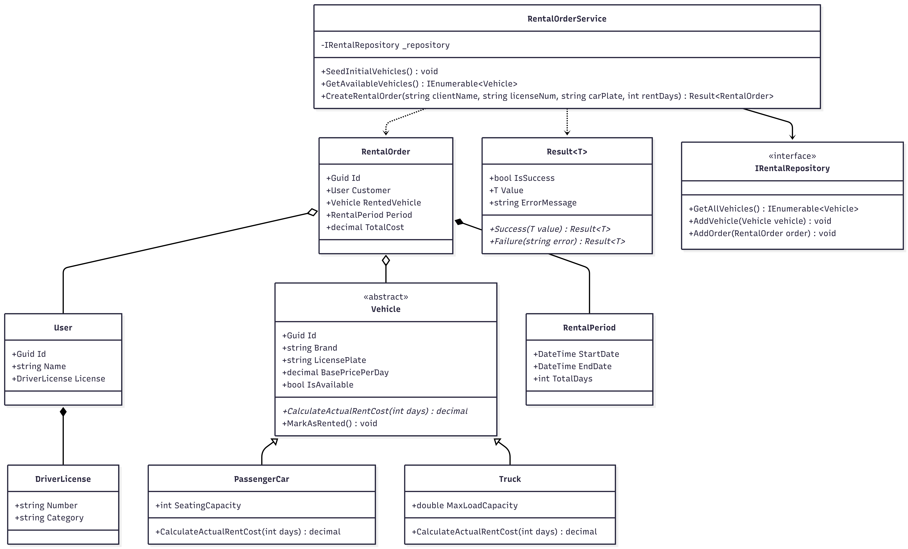

# Лабораторна робота №34

## Тема
Підсумковий міні-проєкт: ітерація 1. Постановка задачі, модель предметної області, архітектурний каркас і CI.

## Мета
Запустити підсумковий проєкт як керовану серію ітерацій. Визначити предметну область, зафіксувати вимоги, спроєктувати модель, створити структуру рішення, реалізувати перший вертикальний зріз та підготувати артефакти для переходу до наступної фази розробки.

---

## 1. Структура репозиторію та артефакти

Проєкт організовано відповідно до архітектурного шаблону Onion/Clean Architecture. Розподіл файлів системи виглядає наступним чином:

* **src/** — вихідний код програми, розподілений за архітектурними шарами.
    * **Domain/** — ядро системи. Містить сутності предметної області, об'єкти-значення, бізнес-інваріанти, базові винятки та інтерфейси для інфраструктурних сервісів.
    * **Application/** — прикладний шар. Містить сервіси застосунку, сценарії використання, обробники бізнес-процесів та контракти.
    * **Infrastructure/** — інфраструктурний шар. Реалізує інтерфейси доступу до даних (тимчасові колекції в оперативній пам'яті), механізми збереження стану та зовнішні сервіси.
    * **Console/** — шар представлення. Реалізує текстовий інтерактивний інтерфейс користувача, текстове меню, введення даних, виведення результатів та первинну обробку текстових параметрів.
* **tests/** — ізольований тестовий проєкт. Містить модульні тести, які перевіряють бізнес-правила сутностей домену та логіку прикладних сервісів.
* **docs/** — повний пакет супровідної проектної документації.
    * `vision.md` — концепція системи, опис цільової аудиторії, ключові сценарії та нефункціональні обмеження.
    * `backlog.md` — глобальний план розробки з чітким розподілом завдань та пріоритетів між чотирма ітераціями.
    * `class-diagram.md` — статична структура системи, взаємозв'язки сутностей, наслідування та інтерфейси.
    * `sequence-diagram.md` — динаміка взаємодії компонентів під час виконання базового сценарію.
    * `iteration-1.md` — аналітичний звіт за підсумками першого етапу, аналіз ризиків та готовність архітектурного каркасу.
* **.github/workflows/** — автоматизовані сценарії безперервної інтеграції. Конфігураційний файл тестує стабільність коду на віддаленому сервері при кожному оновленні репозиторію.

---

## 2. Специфікація вимог та архітектура

### Інтеграція технологічного стеку
У межах першої ітерації архітектура системи демонструє практичне застосування таких фундаментальних концепцій:
* **Об'єктно-орієнтоване проектування:** Глибоке використання інкапсуляції шляхом закриття внутрішнього стану сутностей, валідація даних у конструкторах для захисту від некоректного стану, реалізація поліморфної поведінки через абстрактні класи та наслідування для специфічних типів об'єктів.
* **Обробка даних та функціональні можливості:** Використання типізованих колекцій, робота зі словниками для швидкого пошуку об'єктів за унікальними ідентифікаторами, застосування LINQ-запитів для фільтрації та вибірки даних на рівні сховища.
* **Надійність та архітектурні патерни:** Реалізація патерну Repository для ізоляції логіки зберігання даних, впровадження залежностей через конструктори класів (Dependency Injection), застосування гібридного підходу до обробки помилок за допомогою поєднання механізму винятків та обгортки результату операції.

### Реалізований вертикальний зріз
Перший вертикальний зріз повністю покриває наскрізний шлях виконання однієї бізнес-операції від взаємодії з користувачем до збереження стану:
1.  **Користувацький інтерфейс:** Приймає текстові дані, валідує типи введення та передає запит у прикладний шар.
2.  **Прикладний сервіс:** Координує виконання операції, знаходить потрібні ресурси через репозиторії, викликає бізнес-логіку.
3.  **Доменні сутності:** Перевіряють внутрішні інваріанти, змінюють свій стан та обчислюють необхідні параметри (наприклад, вартість, терміни).
4.  **Інфраструктурне сховище:** Оновлює стан об'єктів у колекції оперативної пам'яті та реєструє факт виконання операції.
5.  **Зворотний зв'язок:** Результат операції повертається до користувача з детальним текстовим підтвердженням або описом помилки.

---

## 3. Налаштування середовища та запуск

### Попередні вимоги
Для запуску, компіляції та тестування системи на локальній машині розробника необхідно встановити актуальну версію SDK платформи .NET (версії 8.0 або новішої).

### Складання та очищення проєкту
Перед першим запуском або після внесення серйозних змін до структури доменних моделей рекомендується виконати примусове видалення проміжних бінарних файлів та кешу збірки для запобігання конфліктам посилань між шарами за допомогою стандартної команди очищення середовища. Після цього виконується процедура відновлення залежностей і перевірки синтаксичної коректності всього рішення через команду компіляції.

### Тестування системи
Проєкт покритий автоматичними юніт-тестами, які ізольовано перевіряють логіку доменних інваріантів та поведінку сервісів. Запуск тестового набору здійснюється через утиліту виклику тестів платформи.

### Запуск консольного інтерфейсу
Для перевірки роботи реалізованого вертикального зрізу в інтерактивному режимі необхідно запустити проєкт представлення, вказавши шлях до консольного стартап-файлу в командному рядку.

---

## 4. Архітектурна діаграма взаємодії

Для детального розуміння того, як дані проходять крізь шари Clean Architecture під час виконання головного сценарію, нижче наведено діаграму послідовності дій:

### Опис динаміки взаємодії компонентів (за діаграмою)
Діаграма відображає покроковий життєвий цикл запиту в системі, демонструючи чіткий поділ обов'язків та ізоляцію шарів:

1. **Ініціація запиту:** Консольний застосунок (шар представлення) зчитує текстові дані від користувача, робить первинну перевірку типів та викликає прикладний сервіс створення замовлення, передаючи параметри у вигляді простих типів даних.
2. **Звернення до інфраструктури:** Прикладний сервіс звертається до інтерфейсу репозиторію для отримання актуального списку транспортних засобів. Інфраструктурне сховище (InMemory) повертає колекцію об'єктів.
3. **Аналіз бізнес-контексту:** Сервіс самостійно шукає автомобіль за номером та перевіряє його доступність. Якщо правила порушено, ланцюжок перериється і користувач миттєво отримує об'єкт помилки.
4. **Активація доменної логіки:** У разі успіху сервіс ініціює створення нового об'єкта замовлення всередині ядра (шар Domain). Конструктор замовлення автоматично валідує вхідні сутності клієнта та періоду.
5. **Поліморфний розрахунок та зміна стану:** Об'єкт замовлення звертається до сутності автомобіля для обчислення вартості за його власними формулами (залежно від типу авто), після чого автомобіль виконує внутрішню команду та змінює свій статус на зайнятий.
6. **Збереження та фіксація:** Сервіс реєструє нове сформоване замовлення в інфраструктурному репозиторії.
7. **Повернення результату:** Прикладний шар обгортає створене замовлення в безпечний контейнер успішного результату і передає його назад на рівень консолі, яка розфарбовує текст у зелений колір та виводить фінальну квитанцію для користувача.

---

## 5. Тестування та верифікація системи

### Опис тестового набору (Unit Tests)
Для гарантії стабільності бізнес-логіки та захисту від регресії коду на першій ітерації було реалізовано набір із 8 ізольованих модульних тестів. Вони покривають ключові компоненти ядра системи:

1. **Валідація створення користувача:** Перевірка захисного інваріанта в конструкторі, який блокує реєстрацію клієнта з порожнім або некоректним іменем, викликаючи відповідний виняток.
2. **Перевірка параметрів вантажівок:** Тестування бізнес-правила, що забороняє встановлювати нульову або від'ємну вантажопідйомність для комерційного транспорту під час ініціалізації об'єкта.
3. **Розрахунок вартості для легкових авто:** Верифікація математичної логіки обчислення фінальної вартості оренди, яка має дорівнювати базовій добовій ставці, помноженій на кількість днів.
4. **Розрахунок вартості з урахуванням тоннажу:** Перевірка поліморфного методу вантажівок, який автоматично додає специфічний фінансовий збір за кожну тонну максимальної місткості до базової вартості оренди.
5. **Зміна стану доступності:** Тест контролює, що після виклику методу фіксації оренди внутрішній прапорець доступності транспортного засобу коректно змінюється, сигналізуючи про зайнятість авто.
6. **Успішний сценарій створення замовлення:** Перевірка наскрізної роботи прикладного сервісу. Тест підтверджує, що за умови наявності вільного авто сервіс повертає позитивний результат, створює сутність замовлення та блокує автомобіль для наступних клієнтів.
7. **Обробка відсутності ресурсу:** Тестування стійкості сервісу до помилок. Якщо введено номерний знак автомобіля, якого немає в репозиторії, система безпечно повертає об'єкт невдачі з чітким описом проблеми.
8. **Захист від повторного擁 бронювання:** Перевірка бізнес-сервісу на спробу орендувати автомобіль, який уже заброньовано. Сервіс має заблокувати операцію та повернути помилку, не створюючи дублюючого замовлення.

---

## 6. Відповіді на контрольні питання

### 1. Чому діаграми і backlog є частиною кодувальной роботи, а не "додатком до неї"?
Діаграми та беклог визначають правила, за якими пишеться код, і є його безпосереднім відображенням у вищому рівні абстракції. Беклог структурує послідовність створення функціоналу, запобігаючи хаотичній розробці. UML-діаграми виступають архітектурним кресленням: вони допомагають зафіксувати інтерфейси та зв'язки між компонентами до того, як буде витрачено час на написання неефективного коду. Робота без цих артефактів призводить до появи архітектурного боргу, постійного рефакторингу та несумісності окремих модулів системи.

### 2. Що таке вертикальний зріз і чим він кращий за хаотичне створення всіх класів наперед?
Вертикальний зріз (Vertical Slice) — це реалізація одного мінімального, але повністю завершеного користувацького сценарію, який проходить крізь усі шари архітектури (від інтерфейсу користувача до бази даних). На відміну від горизонтального підходу (де спочатку створюються всі сутності домену, потім усі репозиторії, а потім весь UI), vertical slice дозволяє одразу отримати працюючий прототип системи, протестувати правильність налаштування зв'язків та посилань між шарами архітектури на ранньому етапі, а також суттєво зменшити ризик виявлення глобальних помилок проектування наприкінці розробки.

### 3. Які інваріанти краще перевіряти в сутностях, а які в сервісах?
* **Внутрішні інваріанти (в сутностях):** Перевіряють правила, що стосуються виключно внутрішнього стану конкретного об'єкта і не залежать від зовнішнього контексту чи інших сутностей. Ці перевірки розміщують у конструкторах та методах сутностей (наприклад, перевірка на пусте ім'я, заборона від'ємної ціни, валідація формату ідентифікатора). Об'єкт домену фізично не повинен існувати або переходити в некоректний стан.
* **Бізнес-процеси та контекстні інваріанти (в сервісах):** Перевіряють правила, що вимагають взаємодії кількох незалежних об'єктів, перевірки даних у сховищах або звернення до зовнішніх сервісів. Наприклад, перевірка, чи не зайнятий ресурс іншим клієнтом на ці ж дати, або чи існує користувач із таким ідентифікатором у базі даних. Сутність самостійно не має доступу до репозиторію, тому цю роль бере на себе сервіс застосунку.

### 4. Навіщо відокремлювати Domain, Application, Infrastructure, Console?
Відокремлення шарів реалізує принцип розділення обов'язків (Separation of Concerns) і захищає бізнес-логику від впливу зовнішніх технологій:
* **Domain** містить чисту бізнес-модель. Він нічого не знає про бази даних, консоль чи веб-інтерфейси, тому є максимально стабільним, легким для тестування та повторного використання.
* **Application** описує сценарії використання системи. Він виступає оркестратором, спрямовуючи потік даних між доменом та інфраструктурою.
* **Infrastructure** ховає за контрактами технічні деталі (роботу з диском, базами даних, сторонніми API). Її можна повністю переписати або замінити без зміни логіки домену чи сервісів.
* **Console** відповідає виключно за введення та виведення інформації користувачу. Текстовий інтерфейс можна легко замінити на графічний або веб-інтерфейс, не зачіпаючи ядро системи.

### 5. Чому Lab 35 повинна будуватися саме на артефактах Lab 34, а не з нуля?
Суть ітеративної розробки полягає в поступовому нарощуванні функціоналу навколо вже перевіреного та працюючого архітектурного каркасу. Попередня лабораторна робота закладає фундамент: структуру рішення, базові контракти, налаштовані звкязки проєктів та правила валідації. Створення проєкту з нуля в наступній лабораторній роботі нівелює ідею ітеративності, ламає історію змін у системі контролю версій та призводить до повторення помилок налаштування архітектурних шарів, які вже були успішно виправлені та протестовані.